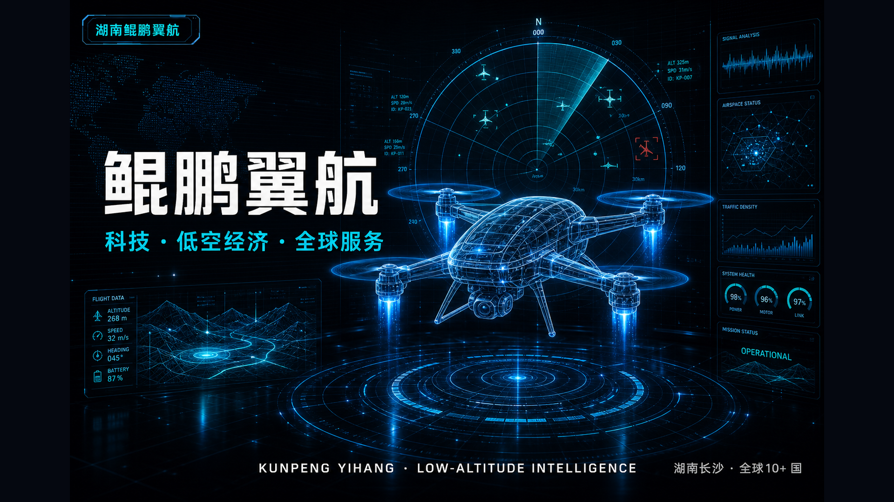
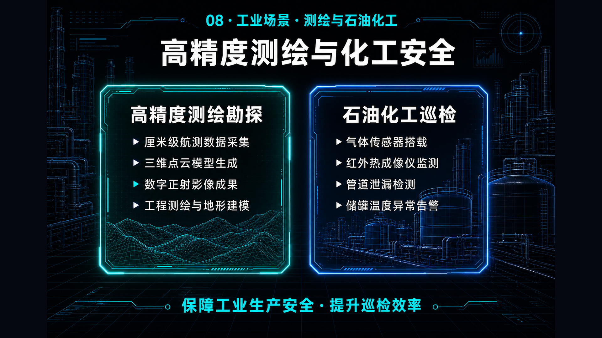
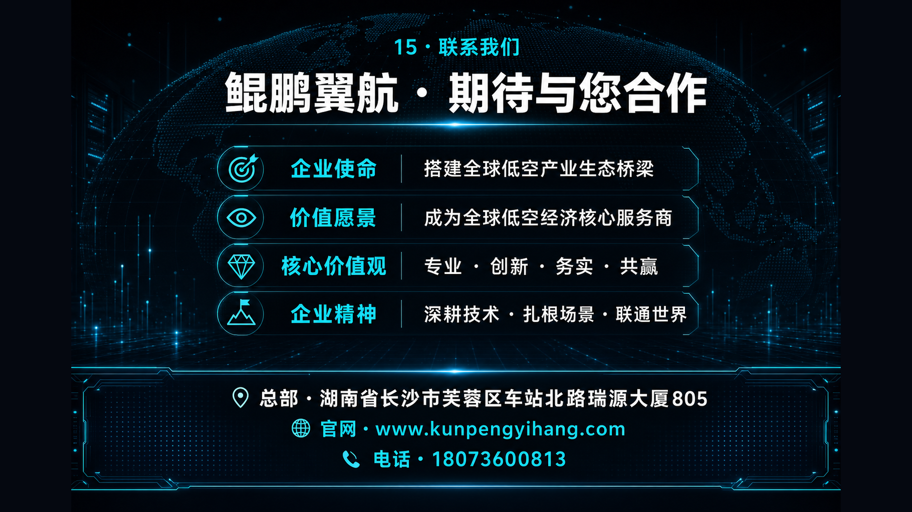

# 🎨 company-deck-c1-hud

> **为科技/无人机/低空经济公司一键生成 15 页 C 风格（未来数据大屏）公司宣传 PPT**

[](https://opensource.org/licenses/MIT)
[](https://github.com/yaoywei/company-deck-c1-hud/stargazers)
[](http://makeapullrequest.com)

## ✨ 特性

- 🎯 **6 步标准化工作流** — 内容分析 → 风格决策 → 主图生成 → 三端交付 → 文字核验 → 风险扫描
- 🎨 **C 风格专属** — 未来数据大屏 / HUD 调性，匹配无人机、低空经济、智能制造
- 📦 **三端输出** — PPTX（可编辑）+ PDF（通用）+ HTML（动画）
- ✅ **vision 自动核验** — 文字准确率 100%
- 💰 **$20-30 一次成型** — 30-60 分钟交付

## 🚀 快速开始

### 一行命令安装

```bash
curl -fsSL https://raw.githubusercontent.com/yaoywei/company-deck-c1-hud/main/install.sh | bash
```

### 手动安装

```bash
git clone https://github.com/yaoywei/company-deck-c1-hud.git
cd company-deck-c1-hud
bash install.sh
```

### 在 Hermes 中使用

重启 Hermes 后，用关键词触发：

> "用 company-deck-c1-hud 风格，给[公司名]做 15 页宣传 PPT"

或者：

> "用 future data dashboard 风格，给[公司名]做 15 页公司简介"

## 📖 文档

- **[SKILL.md](SKILL.md)** — 完整工作流说明
- **[install.sh](install.sh)** — 一键安装脚本
- **[examples/](examples/)** — 完整产物示例（鲲鹏翼航 v3）

## 🎨 风格示例：C · 未来数据大屏

<div align="center">

| 封面 | 工业场景 | 联系我们 |
|:---:|:---:|:---:|
|  |  |  |

</div>

- **主色调**：深蓝黑底 + 电光蓝霓虹 + 青色数据流
- **视觉元素**：HUD 仪表盘、雷达扫描、数字地图、线框无人机、数据面板
- **适合行业**：无人机、低空经济、智能制造、数字孪生、智慧城市

## 📋 工作流（6 步）

1. **内容分析** — 读取公司介绍，输出 15 页大纲
2. **风格决策** — 默认 C 风格，不出对比图
3. **主图生成** — 15 张 16:9 主图，$20-30
4. **三端交付** — PPTX (26MB) + PDF (4.6MB) + HTML (34MB)
5. **文字核验** — vision 逐张 OCR 验证
6. **风险扫描** — 输出 `risk-scan-report.md`

## 🤝 贡献

欢迎提交：
- 🐛 **错字修正**（中文 OCR 常见问题）
- 🎨 **prompt 优化**（让主图更精准）
- 🌐 **风格变体**（如 A 极简科技蓝、B 科技国潮金）
- 📝 **文档改进**

## 📜 许可证

MIT © [yaoywei](https://github.com/yaoywei)

## 🙏 致谢

- 验证案例：[湖南鲲鹏翼航](https://www.kunpengyihang.com) — 低空经济头部企业
- 技术栈：python-pptx + LibreOffice + reveal.js + image_generate + vision_analyze

---

⭐ 如果这个 skill 对你有帮助，欢迎 star！
